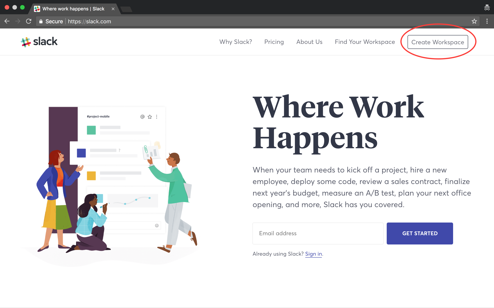
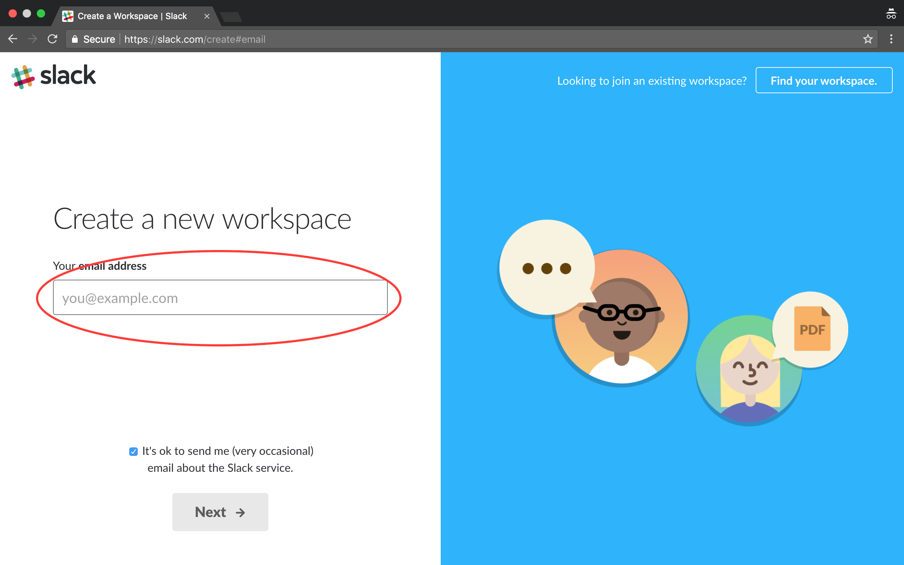
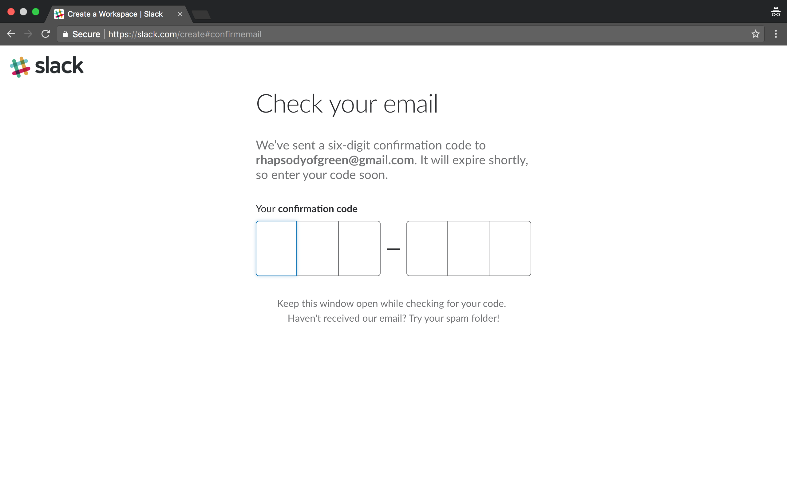
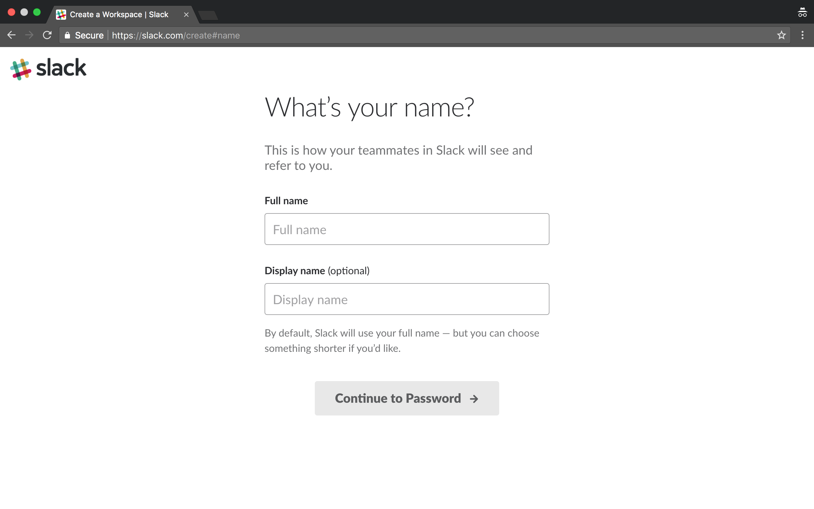
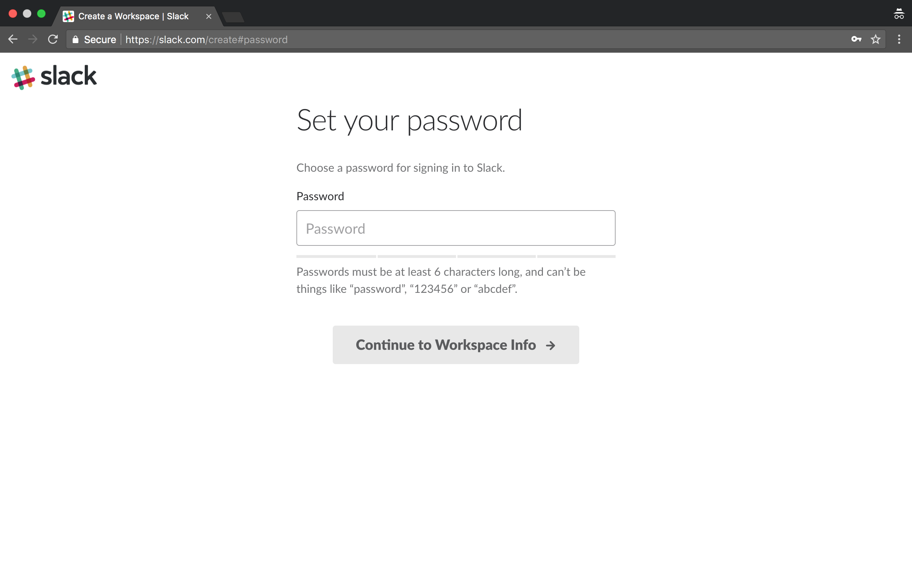
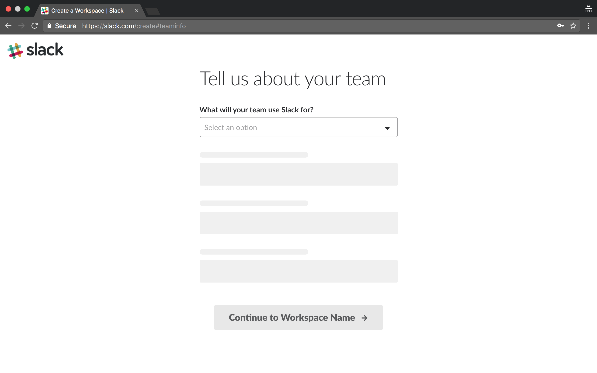
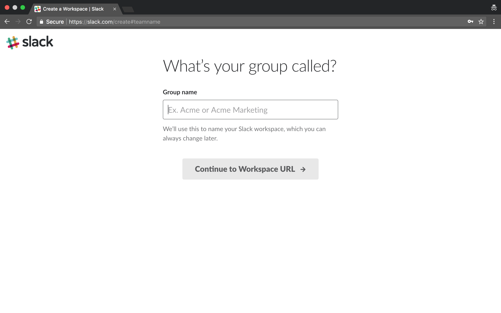
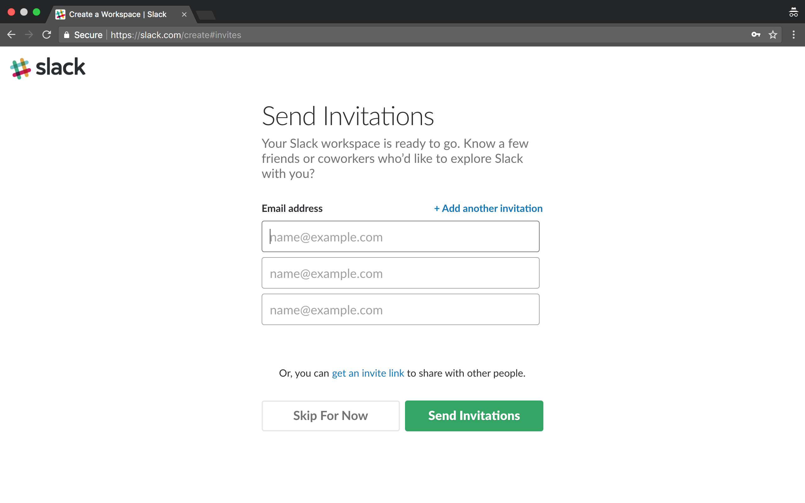
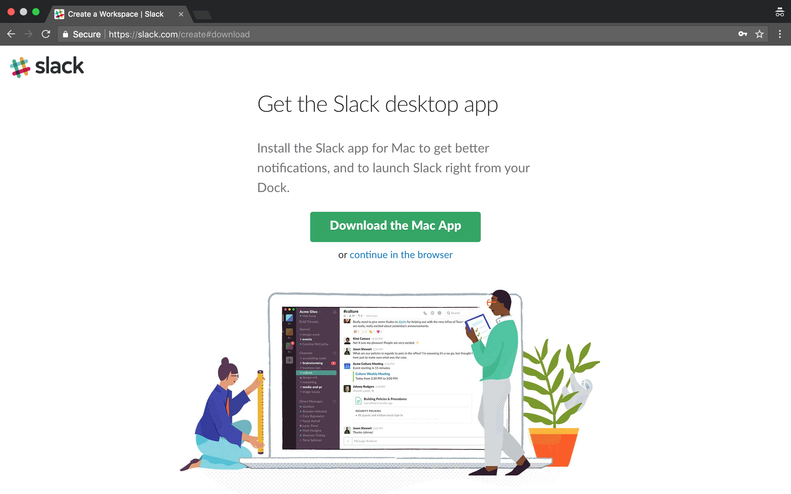

| [Home](README.md) | *WORKSPACE* | [Slack App](slack_app.md) | [Samples](slackbots.md) |

# Create Slack Workspace

_steps required to create a slack workspace_

When we are done with this step, you will have created your own workspace. This 
means that you'll need to chose the name of your workspace and you will 
act as it's administrator. If you wish to build a listening robot where you
don't have administrator access, you will need to have the administrator set
up access to your bot for you. These steps will help you walk through what 
the administrator needs to do.

### 1. Create Workspace

### 2. Enter your Email

This has to be a real email as you are going to need to check it for a 
verification string.

### 3. Confirm your Email

### 4. Slack Name

_are we using made up names here? I'm Batman._

### 5. Password

### 6. Slack Survey

### 7. Group Name

*IMPORTANT*

This is where we identify the name of your workspace. Don't spent too
long considering it, you can create as many workspaces as you want,
but it should be something you may want to use in the future.

The next step will ask for your workspace URL. The group name will need
to be reduced to letters, numbers and dashes to be meaningful as
a URL. Since the URL is unique, you may want to consider that before
deciding on your group name.

### 8. URL

Remember that you *can* go back one page and change your group name.

### 9. Review the Terms

_you read these, right?_

### 10. Send Invitations

This is up to you, you don't have to do this now of course.

### 11. Desktop App

Personally, I like the app, but it will work fine in the browser too.

### 12. Congratulate Youself

You are now the proud administrator of your own Slack Workspace.
